  

  
  

## Hi, I'm Zhang Zherui

I build AI systems that are meant to be understood, measured, and actually run.

- Working on **AI Agents, RAG systems, model tooling, and distributed backends**
- Interested in **retrieval quality, context transfer, MCP ecosystems, and observability**
- Comfortable across **Java / Python / TypeScript** and full-stack product development
- I enjoy turning ambitious ideas into small, testable, maintainable systems

> Build the system. Trace the behavior. Improve what matters.

## Featured work

| Project | What it explores | Core stack |
| --- | --- | --- |
| [ARag](https://github.com/March-77/ARag) | Full-stack knowledge platform with ingestion, intent retrieval, model routing, streaming chat, and RAG tracing | Java, Spring Boot, React, Milvus |
| [MiniCoze](https://github.com/March-77/MiniCoze) | Configurable Agent platform with workflows, RAG, sessions, and MCP tools | Spring AI, Vue, pgvector |
| [ThoughtRelay](https://github.com/March-77/ThoughtRelay) | KV-cache and attention-state transfer between LLM agents, including cross-model projection | Python, PyTorch, vLLM |
| [CodeIndex](https://github.com/March-77/CodeIndex) | Reasoning-based document RAG built around hierarchical PageIndex search | FastAPI, Vue, PageIndex |
| [RGUI](https://github.com/March-77/RGUI) | Cross-platform desktop full-text search powered by ripgrep | Python, CustomTkinter, ripgrep |
| [market](https://github.com/March-77/market) | High-concurrency voucher and flash-sale system with load testing and observability | Java, Redis, RabbitMQ, k6 |

## Toolbox

  
  
  
  
  
  
  
  
  
  
  

## GitHub activity

  <picture>
    <source media="(prefers-color-scheme: dark)" srcset="./profile/stats-dark.svg" />
    <source media="(prefers-color-scheme: light)" srcset="./profile/stats-light.svg" />
    
  </picture>
  <picture>
    <source media="(prefers-color-scheme: dark)" srcset="./profile/languages-dark.svg" />
    <source media="(prefers-color-scheme: light)" srcset="./profile/languages-light.svg" />
    
  </picture>

## Contribution trail

  <picture>
    <source media="(prefers-color-scheme: dark)" srcset="./profile/github-snake-dark.svg" />
    <source media="(prefers-color-scheme: light)" srcset="./profile/github-snake.svg" />
    
  </picture>

  Profile assets refresh automatically every day with GitHub Actions.

